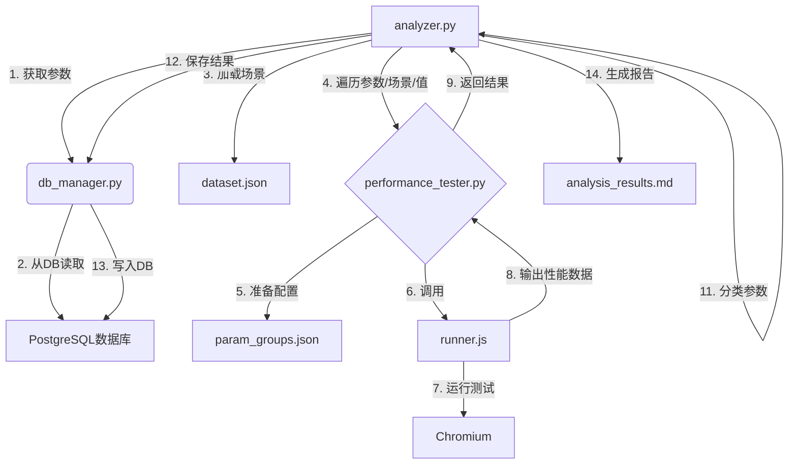

# V8参数影响分析脚本 - 需求与功能设计

## 1. 背景与目标

本项目旨在设计并实现一个自动化脚本，用于分析V8引擎的启动参数对程序性能的影响。通过对不同参数值进行性能测试，脚本将参数分为三类，以指导后续的参数调优工作：

1.  **无影响参数**: 对程序性能几乎没有影响。
2.  **稳定影响参数**: 对性能有显著影响，且最优值方向稳定（例如，某个值在大多数场景下都表现最好）。
3.  **场景敏感参数**: 对性能有显著影响，但最优值随测试场景变化而变化。

## 2. 需求分析

### 2.1 功能性需求

*   **FR1: 参数读取**: 脚本应能从PostgreSQL数据库中读取待分析的V8参数信息（名称、类型、默认值）。
*   **FR2: 性能测试**: 脚本应能针对每个参数的不同取值，在多个目标场景下自动执行性能测试。
*   **FR3: 数据处理**: 脚本需要对多次运行的性能数据进行清洗（如去除异常值）和聚合（如计算平均值）。
*   **FR4: 影响评估**: 脚本需要根据性能数据计算每个参数的“影响值”和“方向稳定性”。
*   **FR5: 参数分类**: 脚本应根据预设的阈值，自动将参数归入三个类别之一。
*   **FR6: 结果存储**: 分析结果（影响值、稳定性、分类等）需要被写回数据库进行持久化。
*   **FR7: 报告生成**: 脚本应能生成一份人类可读的Markdown格式的分析报告，总结各参数的分类情况。
*   **FR8: 可配置性**: 脚本的关键参数（如影响阈值、稳定性阈值、测试重复次数）应可通过配置文件进行调整。

### 2.2 非功能性需求

*   **NFR1: 模块化**: 脚本设计应遵循高内聚、低耦合的原则，将数据管理、测试执行和分析逻辑分离。
*   **NFR2: 可扩展性**: 脚本应易于扩展，以支持新的参数类型、测试场景或分析维度。
*   **NFR3: 自动化**: 整个分析流程应能一键启动，无需人工干预。

## 3. 总体设计

### 3.1 核心算法

#### 3.1.1 数据收集（已更新）

为了隔离单个参数的独立影响，排除与其他参数的潜在关联，我们采用基于随机背景参数的测试方法。

1.  **确定测试值**:
    *   **布尔型**: `{true, false}`
    *   **数值型**: 对于默认值 `V`，测试集合为 `{V/2, V, 3V/2, 2V}` (结果取整)。若 `V=0`，则使用 `{0, 1, 2, 4}`。
    *   **字符串型**: 不参与性能分析。

2.  **执行性能测试**:
    *   对于每个待测参数 `P`：
        1.  **生成随机背景**: 从除 `P` 以外的所有参数中，随机生成 `M` 组参数配置（`Config_1, Config_2, ..., Config_M`）。`M` 可在配置文件中设置。
        2.  **执行测试**: 对于每个目标场景 `C`，每个随机背景 `Config_i`，以及参数 `P` 的每个测试值 `v`，重复执行性能测试 `N` 次。
        3.  **数据清洗**: 对 `N` 次性能结果进行清洗（如去除异常值后取平均），得到该具体配置下的稳定性能值 `Perf(P, v, C, Config_i)`。

#### 3.1.2 指标计算（已更新）

指标计算将综合 `M` 个随机背景下的结果。

1.  **影响值 (Impact Value)**:
    *   **背景基准性能**: `Perf_baseline(C, Config_i) = Perf(P, V_default, C, Config_i)`。
    *   **背景场景影响**: `Impact(P, C, Config_i) = max_v(|(Perf(P, v, C, Config_i) - Perf_baseline(C, Config_i)) / Perf_baseline(C, Config_i)|)`。
    *   **平均场景影响**: `Impact(P, C) = mean_i(Impact(P, C, Config_i))`，对 `M` 个背景下的影响取平均。
    *   **综合影响值**: `Impact_Overall(P) = mean_C(Impact(P, C))`，对所有场景的影响再取平均。

2.  **方向稳定性 (Direction Stability)**:
    *   **背景最优值**: `v_best(C, Config_i) = argmin_v(Perf(P, v, C, Config_i))`。
    *   **场景主导最优值**: `v_best_dominant(C) = mode(v_best(C, Config_1), ..., v_best(C, Config_M))`，即在场景 `C` 的 `M` 个随机背景下，出现次数最多的最优值。
    *   **全局主导方向**: `v_dominant = mode(v_best_dominant(C_1), v_best_dominant(C_2), ...)`。
    *   **稳定性**: `Stability(P) = (v_dominant 的出现次数) / (总场景数)`。

#### 3.1.3 参数分类

1.  **第一类 (无影响)**: `Impact_Overall(P) < impact_threshold`。
2.  **第二类 (稳定影响)**: `Impact_Overall(P) >= impact_threshold` 且 `Stability(P) >= stability_threshold`。
3.  **第三类 (场景敏感)**: `Impact_Overall(P) >= impact_threshold` 且 `Stability(P) < stability_threshold`。

### 3.2 脚本架构

脚本将部署在 `scripts/parameter-analyzer/` 目录下，由以下模块组成：

*   **`analyzer.py` (主控模块)**: 负责整个分析流程的调度，执行计算，并生成报告。
*   **`db_manager.py` (数据库交互模块)**: 封装所有数据库操作，包括读取参数和保存结果。
*   **`performance_tester.py` (性能测试模块)**: 封装对 `scripts/page-executor/runner.js` 的调用，管理测试配置和解析结果。
*   **`config.ini` (配置文件)**: 存储数据库连接信息、文件路径以及分析阈值等。

### 3.3 数据流图



## 4. 模块详细设计

### 4.1 `analyzer.py`

*   **主要职责**: 流程控制、数据分析、报告生成。
*   **主要函数**:
    *   `main()`: 主入口，按顺序调用其他函数。
    *   `load_config()`: 从 `config.ini` 加载配置。
    *   `analyze_parameters()`: 核心分析函数，循环遍历参数和场景，调用 `performance_tester`，计算指标并分类。
    *   `generate_report()`: 将最终结果格式化为Markdown报告。

### 4.2 `db_manager.py`

*   **主要职责**: 数据库的读写操作。
*   **主要函数**:
    *   `get_parameters_to_analyze(param_types)`: 获取指定类型的参数列表。
    *   `save_analysis_results(results)`: 将分析结果批量写入新的 `parameter_analysis` 表中。

### 4.3 `performance_tester.py`

*   **主要职责**: 抽象化性能测试过程。
*   **主要函数**:
    *   `run_test(parameter, value, scene, num_runs)`: 针对单个配置执行 `num_runs` 次测试。
    *   `_generate_param_group(parameter, value)`: 生成 `runner.js` 所需的 `param_groups.json`。
    *   `_execute_runner()`: 调用 `node` 运行 `runner.js` 并解析性能数据。

### 4.4 `config.ini`

```ini
[postgresql]
host = localhost
port = 5432
database = tuner4js
user = postgres
password = s4plususer

[files]
source_file = /path/to/v8/src/flags/flag-definitions.h
dataset_path = /path/to/dataset.json

[analysis]
impact_threshold = 0.05
stability_threshold = 0.85
test_runs = 5
random_configs_per_param = 10
```

## 5. 数据库设计

建议在现有数据库中新增一张表 `parameter_analysis` 用于存储分析结果。

*   **表名**: `parameter_analysis`
*   **字段**:
    *   `analysis_id` (PK, SERIAL)
    *   `parameter_id` (FK, INT): 关联到 `parameter` 表
    *   `impact_value` (FLOAT): 计算出的综合影响值
    *   `stability_value` (FLOAT): 计算出的方向稳定性
    *   `category` (VARCHAR): 'none', 'stable', 'sensitive'
    *   `dominant_value` (VARCHAR): 表现最优的主导参数值
    *   `analysis_timestamp` (TIMESTAMP): 分析完成的时间

## 6. 预期产出

1.  **源代码**:
    *   `scripts/parameter-analyzer/analyzer.py`
    *   `scripts/parameter-analyzer/db_manager.py`
    *   `scripts/parameter-analyzer/performance_tester.py`
    *   更新后的 `scripts/parameter-analyzer/config.ini`
2.  **数据库变更**: 新增 `parameter_analysis` 表。
3.  **文档**:
    *   `scripts/parameter-analyzer/design_doc.md` (本文档)
    *   `scripts/parameter-analyzer/analysis_results.md` (示例报告)